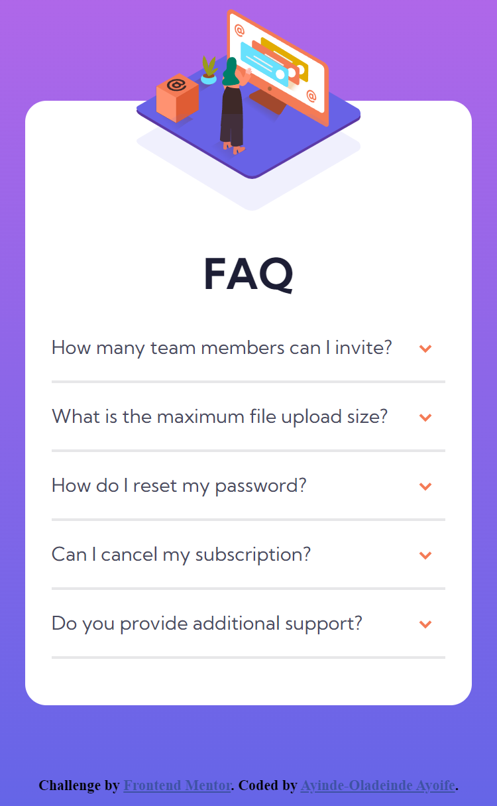

# Frontend Mentor - FAQ accordion card solution

This is a solution to the [FAQ accordion card challenge on Frontend Mentor](https://www.frontendmentor.io/challenges/faq-accordion-card-XlyjD0Oam). Frontend Mentor challenges help you improve your coding skills by building realistic projects. 

## Table of contents

- [Overview](#overview)
  - [The challenge](#the-challenge)
  - [Screenshot](#screenshot)
- [My process](#my-process)
  - [Built with](#built-with)
- [Author](#author)
- [Acknowledgments](#acknowledgments)

## Overview

### The challenge

Users should be able to:

- View the optimal layout for the component depending on their device's screen size
- See hover states for all interactive elements on the page
- Hide/Show the answer to a question when the question is clicked

### Screenshot

## My process

### Built with

- Flexbox

## Author

- Frontend Mentor - [@Ayoife](https://www.frontendmentor.io/profile/Ayoife)

## Acknowledgments

I would like to thank [@KevinPowell](https://www.youtube.com/kevinpowell) for his amazing webDev tutorials and for introducing me to this awesome website (https://www.frontendmentor.io)
